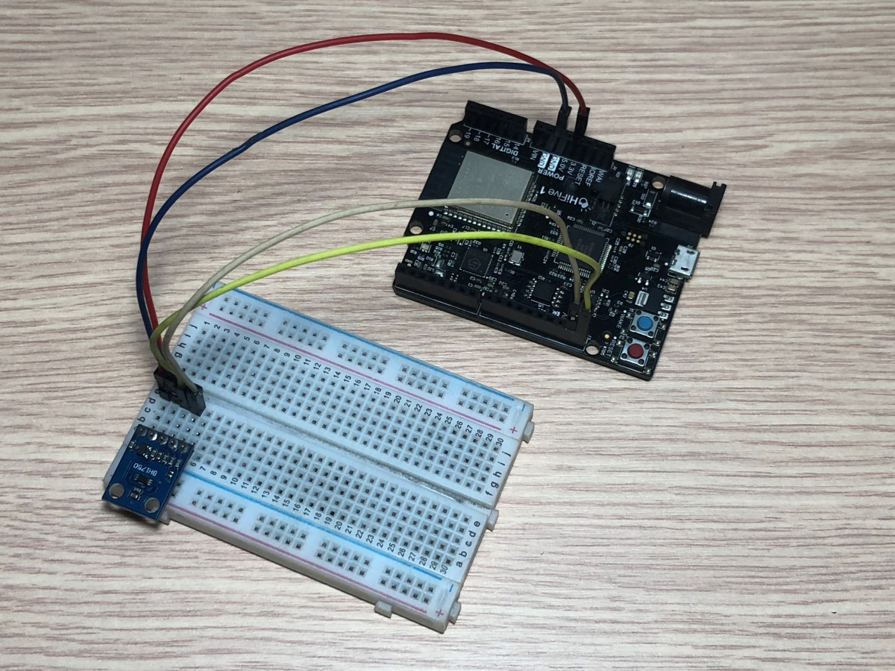
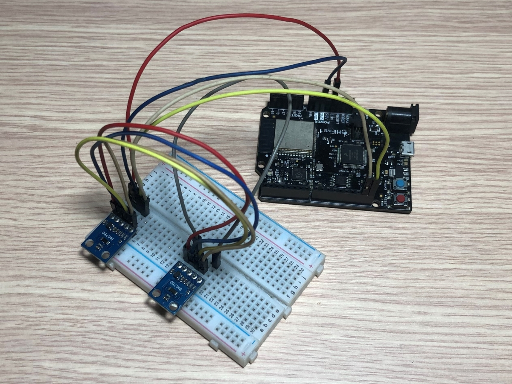

# SiFive HiFive1 Rev B with BH1750 I2C Light Sensor
This is a library used for SiFive Hifive 1 Rev B board to communicate with BH1750 Digital Light Sensor and examples of how to use this it. 
The library used BH1750 GY-302 module to develop and test.

# Build Examples
- Use FreedomStudio IDE to create a new SiFive project for HiFive 1 Rev B board.
- Copy library files include `BH1750.c`, `BH1750.h`, `delay.c` to the project
- Select and copy an example source file in `examples` folder to the project
- And build

# Hardware Requirements
- SiFive Hifive 1 Rev B board
- LCD1602 with I2C module

# Wire Connections
    HiFive1 Rev B      BH1750
    3V3           <--> VCC (3V3 or 5V)
    GND           <--> GND
    IO19 (SCL)    <--> SCL
    IO18 (SDA)    <--> SDA
    GND           <--> ADD (not connected or GND)
    
    ADD pin is used to set sensor I2C address. If it has voltage greater or equal to
    0.7VCC voltage (e.g. you've connected it to VCC) the sensor address will be
    0x5C. In other case (if ADD voltage less than 0.7 * VCC) the sensor address will
    be 0x23 (by default).

## Example of connect to one BH1750 Light Sensor

## Example of connect to two BH1750 Light Sensors

# Development tools
- SiFive IDE: FreedomStudio-4.7.2.2020-11-2-x86_64-w64-mingw32 (https://github.com/sifive/freedom-studio/releases/tag/v2020.11.1)

# Documents
- I2C-Master Core Specification - [i2c_specs.pdf](https://github.com/olofk/i2c/blob/master/doc/i2c_specs.pdf)
- SiFive FE310-G002 Manual v19p05 - [fe310-g002-manual-v19p05.pdf](https://sifive.cdn.prismic.io/sifive%2F59a1f74e-d918-41c5-b837-3fe01ba7eaa1_fe310-g002-manual-v19p05.pdf)
- BH1750 Datasheet: http://www.elechouse.com/elechouse/images/product/Digital%20light%20Sensor/bh1750fvi-e.pdf